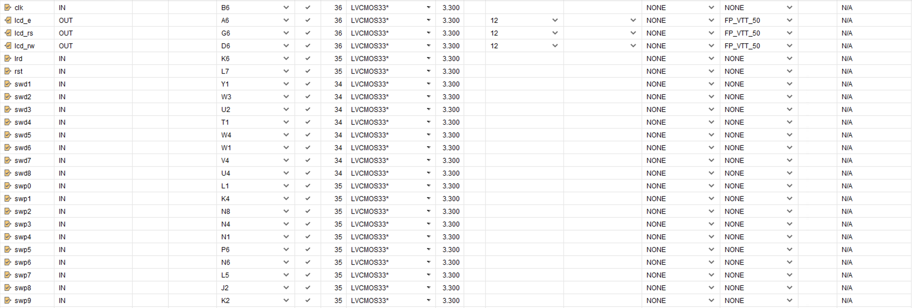
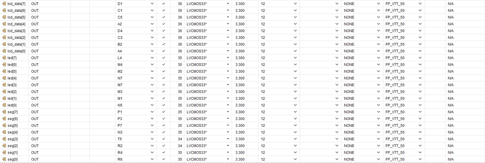

# fpga-calculator

A multi-function fpga Calculator capable of addition, subtraction, multiplication, and division.

HBE-Combo II DLD (Xilinx), Verilog HDL


## Function definition

- 수의 대상 : 자연수, 정수, 유리수, (무리수), (허수)
- 연산의 종류 : 덧셈, 뺄셈, 곱셈, 나눗셈
- 입출력 : 무한대로 입력받기
- 시리얼 통신
- 연산자의 우선순위(스택)

### 자연수의 덧셈, 뺄셈, 곱셈

가장 큰 이슈 : one hot code

### 자연수의 나눗셈

지수형 표현 방식(십의 승수를 이용한 표현(가수, 기수, 승수(지수)))

정규화 표현 방식 : 소수점 이상으로 한 자리만 표현하고 지수를 이용해서 표현하는 방식

### 정수의 사칙연산

### 실수의 사칙연산

### 무리수의 사칙연산

### 연산자의 우선순위

### 데이터 입력 범위, 오버풀로우 발생 범위

## Code explanatinon

## Binary to BCD(Double dabble algorithm)

Result

```md
Hundreds Tens Ones   Original
  0010   0100 0011   11110011
```

243

```md
0000 0000 0000   11110011   Initialization
0000 0000 0001   11100110   Shift
0000 0000 0011   11001100   Shift
0000 0000 0111   10011000   Shift
0000 0000 1010   10011000   Add 3 to ONES, since it was 7
0000 0001 0101   00110000   Shift
0000 0001 1000   00110000   Add 3 to ONES, since it was 5
0000 0011 0000   01100000   Shift
0000 0110 0000   11000000   Shift
0000 1001 0000   11000000   Add 3 to TENS, since it was 6
0001 0010 0001   10000000   Shift
0010 0100 0011   00000000   Shift
   2    4    3
       BCD
```

24310

```md
0000 0000 0000   11110011   Initialization
0000 0000 0001   11100110   Shift
0000 0000 0011   11001100   Shift
0000 0000 0111   10011000   Shift
0000 0000 1010   10011000   Add 3 to ONES, since it was 7
0000 0001 0101   00110000   Shift
0000 0001 1000   00110000   Add 3 to ONES, since it was 5
0000 0011 0000   01100000   Shift
0000 0110 0000   11000000   Shift
0000 1001 0000   11000000   Add 3 to TENS, since it was 6
0001 0010 0001   10000000   Shift
0010 0100 0011   00000000   Shift
   2    4    3
       BCD
```

각 반복에서 왼쪽의 BCD 값을 두 배로 만들고 원래 비트 패턴에 따라 1 또는 0을 추가하여 동시에 두 작업을 수행한다. 왼쪽으로 쉬프트하는 것으로 두 작업을 동시에 수행한다. 어떤 숫자가 5 이상인 경우 10진수에서 전파되도록 3이 추가된다.

1. 변환할 원래 숫자가 n 비트로 된 레지스터에 저장되어 있다고 가정한다. 원래 숫자와 해당 BCD 표현을 모두 수용할 수 있는 크기의 스크래치 공간을 예약한다. 여기에는 n + 4 x ceil(n/3) 비트가 필요하다.
2. 스크래치 공간을 BCD 자릿수와 원래 레지스터로 분할 한다.
3. 스크래치 공간을 모두 0으로 초기화한다.
4. 알고리즘을 n번 반복한다. 각 반복에서 최소 5인 모든 bCD 자릿수는 3이 추가된다. 그런 다음 전체 스크래치 공간이 한 비트 왼쪽으로 이동한다.

이때 Original number는 unsigned number이다.

## Pin setting




