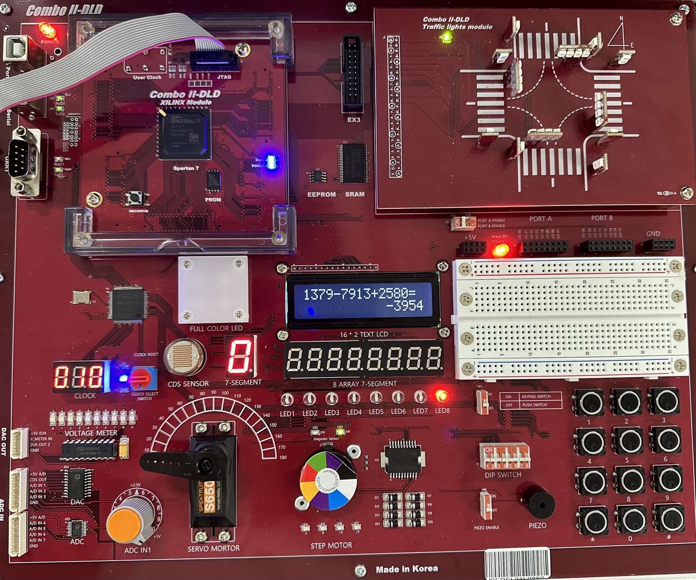

# fpga-calculator

A multi-function fpga Calculator capable of addition, subtraction, and multiplication.

Video

HBE-Combo II DLD (Xilinx), Verilog HDL

## Function definition

- Supported Numbers: Natural numbers, integers (including negative numbers)
- Operations: Addition, subtraction, multiplication
Input/Output: Accepts input indefinitely
- Operator Priority
- Switch from DIP switches to push buttons for operator selection
