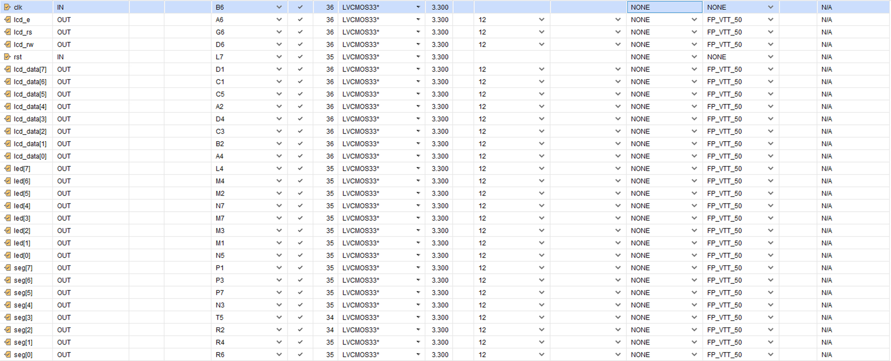
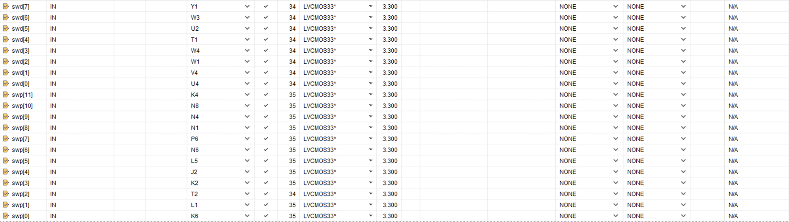

# fpga-calculator

A multi-function fpga Calculator capable of addition, subtraction, multiplication, and division.

HBE-Combo II DLD (Xilinx), Verilog HDL

## Function definition

수의 대상 : 자연수, 정수, 유리수, (무리수), (허수)

연산의 종류 : 덧셈, 뺄셈, 곱셈, 나눗셈(부동소수점)

입출력 : 무한대로 입력받기, 무한대로 출력하기

시리얼 통신

연산자의 우선순위(스택)

## Variable declaration

|Variable|Description|
|---|---|
|||

## Pin setting

