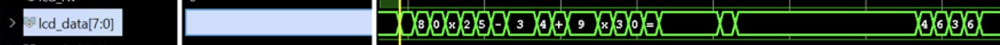

# fpga-calculator

A multi-function fpga Calculator capable of addition, subtraction, and multiplication.

HBE-Combo II DLD (Xilinx), Verilog HDL

## Function definition

- 수의 대상 : 자연수, 정수(음수)
- 연산의 종류 : 덧셈, 뺄셈, 곱셈
- 입출력 : 무한대로 입력받기
- 연산자의 우선순위
- 딥 스위치로 정의한 연산자 입력 기능을 푸시 스위치로 전환
