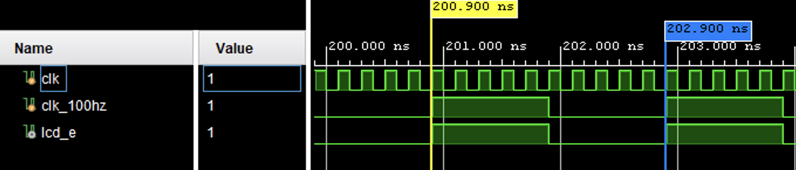
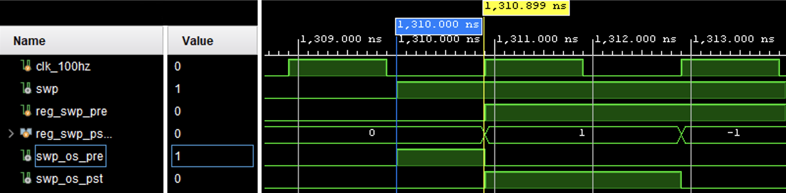
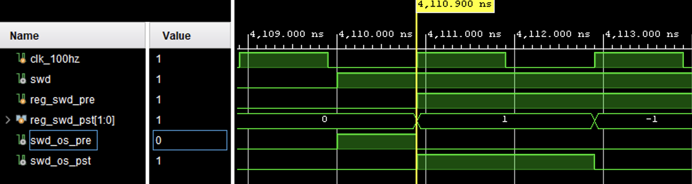

# Description

## Variable declaration - 가장 직관적인 변수명은 무엇일까?

**Module**
|Declaration|Variable|Description|
|---|---|---|
|input|swp1, swp2, swp3, swp4, swp5, swp6, swp7, swp8, swp9, rst, swp0, lrd,|12개의 푸시 스위치는 0~9의 수와 reset 버튼, 그리고 load 버튼으로 구성된다.|
|input|input swd1, swd2, swd3, swd4, swd5, swd6, swd7, swd8,|음의 부호(-), 사칙연산(+, -, x, %), 왼쪽 괄호, 오른쪽 괄호, 등호(=)|
|input|clk|1Hz ~ 500Mz 진동수를 조절할 수 있다. 여기서는 대략 10kHz를 사용한다.|
|output reg [7:0]|seg|푸시 스위치로 입력된 수를 7-segment에 출력한다.|
|output reg [7:0]|led|딥 스위치로 입력된 연산을 LED에 출력한다.|

**Switch input**
|Declaration|Variable|Description|
|---|---|---|
|reg [3:0]|reg_num|눌린 push 스위치에 해당하는 값이 저장된다.|
|reg [7:0]|reg_num_ascii|눌린 push 스위치에 해당하는 아스키 코드가 저장된다.|
|reg [2:0]|reg_opr|눌린 dip 스위치에 해당하는 값이 저장된다.|
|reg [7:0]|reg_opr_ascii|눌린 dip 스위치에 해당하는 아스키 코드가 저장된다.|

**One shot code**
|Declaration|Variable|Description|
|---|---|---|
|assign wire|swp|0~9에 해당하는 어떤 push switch를 누르면 1이 되고 떼면 0이 된다.|
|assign wire|swp_os_pre|push 스위치가 눌릴 때부터 가장 가까운 상승 에지까지 1이다.|
|reg|reg_swp_pre|push 스위치가 눌리는 지점에 가장 가까운 상승 에지부터 스위치가 떼지는 지점에 가장 가까운 상승 에지까지 1만 이다.|
|assign wire|swp_os_pst|push 스위치가 눌리는 시점에 가장 가까운 상승 에지부터 다음 상승 에지까지 1이다.|
|reg [1:0]|reg_swp_pst||
|assign wire|swd||
|assign wire|swd_os_pre||
|reg|reg_swd_pre||
|assign wire|swd_os_pst||
|reg [1:0]|reg_swd_pst||

**Term**
|Declaration|Variable|Description|
|---|---|---|
|reg |reg_trm_sgn|항의 부호|
|reg [31:0]|reg_trm_mgn|항의 절대값|
|reg [31:0]|reg_trm|항의 값|

**Sign-magnitude form**
|Declaration|Variable|Description|
|---|---|---|
|reg [31:0]|reg_rlt|연산 결과를 저장한다.(입력) / -21_4748_3648 ~ 21_4748_3647|
|reg |reg_rlt_sgn|reg_rlt의 부호를 저장한다.|
|reg [31:0]|reg_rlt_mag|reg_rlt의 값을 저장한다. reg_rlt와 같은 32비트로 선언된다.|

**BCD transformation**
|Declaration|Variable|Description|
|---|---|---|
|reg [39:0]|reg_rlt_bcd|연산 결과를 bcd로 저장한다.(출력) / LCD line2의 16칸에 들어갈 10진수 값을 위한 코드이다. 1칸 당 상위 4비트에는 0000을 할당하고 하위 4비트에는 bcd를 할당하여, 총 8비트를 할당한다. bcd가 십진수 한 자리 당 4비트인데 반해, 1칸 당 8비트씩 할당하는 이유는 각 자릿수 값에 8'b0011_0000를 더함으로써 바로 ascii 코드로 바꿀 수 있기 때문이다.|

BCD 변환은 =이 눌린 이후에 진행된다.

|Declaration|Variable|Description|
|---|---|---|
|reg [7:0]|reg_lcd|lcd에 띄울 아스키 값이 들어간다. reg_lcd_swp 또는 reg_lcd_swd에 들어 있는 8비트 아스키 값이 들어간다.|

시뮬레이션 할 때 중요한 변수

|Variable|Description|
|---|---|
|lcd_data|최종적으로 뜨는 데이터다.|
|reg_lcd|LCD 1번째 줄에 뜰 문자를 저장하고 있다.|
|reg_num|입력된 피연산자의 값을 저장하고 있다.|
|reg_opr_ascii|입력된 연산자에 해당하는 아스키 코드를 저장하고 있다.|
|reg_trm|항에 대한 정보이다.|
|reg_rlt|누적 연산된 결과이다.|

## 1. Module declaration

```v
module calculator (
    input swp1, swp2, swp3, swp4, swp5, swp6, swp7, swp8, swp9, rst, swp0, lrd,
    input swd1, swd2, swd3, swd4, swd5, swd6, swd7, swd8,
    input clk, 

    output reg [7:0] seg,
    output reg [7:0] led,
    
    output wire lcd_e,
    output reg lcd_rs, lcd_rw, 
    output reg [7:0] lcd_data
);

// ...

assign lcd_e = clk_100hz;

endmodule
```

## 2. Constant

```v
// constant
parameter 
        delay           = 3'b000,
        function_set    = 3'b001,
        entry_mode      = 3'b010,
        disp_onoff      = 3'b011,
        line1           = 3'b100,
        line2           = 3'b101,
        delay_t         = 3'b110,
        clear_disp      = 3'b111,

        ascii_0 = 8'b0011_0000,
        ascii_1 = 8'b0011_0001,
        ascii_2 = 8'b0011_0010,
        ascii_3 = 8'b0011_0011,
        ascii_4 = 8'b0011_0100,
        ascii_5 = 8'b0011_0101,
        ascii_6 = 8'b0011_0110,
        ascii_7 = 8'b0011_0111,
        ascii_8 = 8'b0011_1000,
        ascii_9 = 8'b0011_1001,
        
        ascii_min = 8'b0010_1101,
        ascii_sum = 8'b0010_1011,
        ascii_sub = 8'b0010_1101,
        ascii_mul = 8'b1101_0111, // 01111000
        ascii_div = 8'b1111_0111, // 0010_0101
        ascii_lpr = 8'b0010_1000,
        ascii_rpr = 8'b0010_1001,
        ascii_equ = 8'b0011_1101, 
        
        ascii_blk = 8'b0010_0000,
        ascii_lar = 8'b0001_0001,

        min = 3'b000,
        sum = 3'b001,
        sub = 3'b010,
        mul = 3'b011,
        div = 3'b100,
        lpr = 3'b101,
        rpr = 3'b110,
        equ = 3'b111;
```

## 3. Clock divider

clk_100hz의 주기는 clk의 주기의 10배이다. clk_100hz와 lcd_e는 동기화되어 있다.



```v
// clock divider
integer cnt_100hz;
reg clk_100hz;
always @(posedge rst or posedge clk)
begin
    if (rst)
        begin
            cnt_100hz <= 0;  
            clk_100hz <= 1'b0;
        end
    else if (cnt_100hz >= 4)
        begin
            cnt_100hz <= 0; 
            clk_100hz <= ~clk_100hz;
        end
    else
        cnt_100hz <= cnt_100hz + 1;
end
```

## 4. Count and state machine

lcd의 주기는 clk_100hz의 주기의 800배이다.

```v
// count
integer cnt;
reg [2:0] state;
always @(posedge rst or posedge clk_100hz)
begin
    if (rst)
        cnt <= 0;
    else
        begin
            case (state)
                delay :
                    if (cnt >= 70) cnt <= 0;
                    else cnt <= cnt + 1;
                function_set :
                    if (cnt >= 30) cnt <= 0;
                    else cnt <= cnt + 1;
                disp_onoff :
                    if (cnt >= 30) cnt <= 0;
                    else cnt <= cnt + 1;
                entry_mode :
                    if (cnt >= 30) cnt <= 0;
                    else cnt <= cnt + 1;
                line1 :
                    if (cnt >= 20) cnt <= 0;
                    else cnt <= cnt + 1;
                line2 :
                    if (cnt >= 20) cnt <= 0;
                    else cnt <= cnt + 1;
                delay_t :
                    if (cnt >= 400) cnt <= 0;
                    else cnt <= cnt + 1;
                clear_disp :
                    if (cnt >= 200) cnt <= 0;
                    else cnt <= cnt + 1;
                default : cnt <= 0;
            endcase
        end
end

// state machine
always@(posedge rst or posedge clk_100hz)
begin
    if (rst) state = delay;
    else
    begin
        case (state)
            delay :             if (cnt == 70)  state <= function_set;
            function_set :      if (cnt == 30)  state <= disp_onoff;
            disp_onoff :        if (cnt == 30)  state <= entry_mode;
            entry_mode :        if (cnt == 30)  state <= line1;
            line1 :             if (cnt == 20)  state <= line2;
            line2 :             if (cnt == 20)  state <= delay_t;
            delay_t :           if (cnt == 400) state <= clear_disp;
            clear_disp :        if (cnt == 200) state <= line1;
            default :                           state <= delay;
        endcase
    end
end
```

## 5. Push switch and dip switch

실제로 버튼을 누르고 있는 시간은 약 0.25s이다.

```v
// push switch
reg [3:0] reg_num;
reg [7:0] reg_lcd_swp;
always@(posedge rst or posedge clk_100hz)
begin
    if (rst)
    begin 
        reg_num <= 4'b0000;
        reg_lcd_swp <= ascii_blk; 
        seg <= 8'b0000_0000;
    end
    else
    begin
        if (swp1)
        begin
            reg_num <= 4'b0001;
            reg_lcd_swp <= ascii_1;
            seg <= 8'b0110_0000;
        end
        else if (swp2)
        begin
            reg_num <= 4'b0010;
            reg_lcd_swp <= ascii_2;
            seg <= 8'b1101_1010;
        end
        else if (swp3)
        begin
            reg_num <= 4'b0011;
            reg_lcd_swp <= ascii_3;
            seg <= 8'b1111_0010;
        end
        else if (swp4)
        begin
            reg_num <= 4'b0100;
            reg_lcd_swp <= ascii_4;
            seg <= 8'b0110_0110;
         end
        else if (swp5)
        begin
            reg_num <= 4'b0101;
            reg_lcd_swp <= ascii_5;
            seg <= 8'b1011_0110;
        end
        else if (swp6)
        begin
            reg_num <= 4'b0110;
            reg_lcd_swp <= ascii_6;
            seg <= 8'b1011_1110;
        end
        else if (swp7)
        begin
            reg_num <= 4'b111;
            reg_lcd_swp <= ascii_7;
            seg <= 8'b1110_0000;
        end
        else if (swp8)
        begin
            reg_num <= 4'b1000;
            reg_lcd_swp <= ascii_8;
            seg <= 8'b1111_1110;
        end
        else if (swp9)
        begin
            reg_num <= 4'b1001;
            reg_lcd_swp <= ascii_9;
            seg <= 8'b1111_0110;
        end
        else if (swp0)
        begin
            reg_num <= 4'b0000;
            reg_lcd_swp <= ascii_0;
            seg <= 8'b1111_1100;
        end
    end
end

// dip switch
reg [7:0] reg_opr;
reg [7:0] reg_lcd_swd;
always@(posedge rst or posedge clk_100hz)
begin
    if (rst)
    begin 
        reg_opr <= sum; // sum
        reg_lcd_swd <= ascii_blk; 
        led <= 0; 
    end
    else
    begin
        if (swd1)
        begin 
            reg_opr <= min;
            reg_lcd_swd <= ascii_min;   
            led <= 8'b1000_0000;  
        end 
        else if (swd2)
        begin 
            reg_opr <= sum;
            reg_lcd_swd <= ascii_sum;    
            led <= 8'b0100_0000; 
        end 
        else if (swd3)
        begin 
            reg_opr <= sub;
            reg_lcd_swd <= ascii_sub;    
            led <= 8'b0010_0000; 
        end 
        else if (swd4)
        begin 
            reg_opr <= mul;
            reg_lcd_swd <= ascii_mul;    
            led <= 8'b0001_0000; 
        end 
        else if (swd5)
        begin 
            reg_opr <= div;
            reg_lcd_swd <= ascii_div;   
            led <= 8'b0000_1000;  
        end 
        else if (swd6)
        begin 
            reg_opr <= lpr;
            reg_lcd_swd <= ascii_lpr;    
            led <= 8'b0000_0100; 
        end 
        else if (swd7)
        begin 
            reg_opr <= rpr;
            reg_lcd_swd <= ascii_rpr;    
            led <= 8'b0000_0010; 
        end 
        else if (swd8)
        begin 
            reg_opr <= equ;
            reg_lcd_swd <= ascii_equ;    
            led <= 8'b0000_0001; 
        end 
    end
end
```

## 6. One shot code

One shot code는 동기화된 신호들을 제어하는 용도로 사용된다.

두 개의 One shot code를 설계하여 사용한다.




```v
// Push switch preceding one shot code
reg reg_swp_pre;

wire swp;
wire swp_os_pre;
assign swp = swp1 | swp2 | swp3 | swp4 | swp5 | swp6 | swp7 | swp8 | swp9 | swp0;
assign swp_os_pre = swp & ~reg_swp_pre;

always@ (posedge rst or posedge clk_100hz)
begin
    if (rst) reg_swp_pre <= 0;
    else reg_swp_pre <= swp;
end

// Push switch post one shot code
reg [1:0] reg_swp_pst;

wire swp_os_pst;
assign swp_os_pst = reg_swp_pst[0] & ~reg_swp_pst[1];

always@ (posedge rst or posedge clk_100hz)
begin
    if (rst) reg_swp_pst <= 2'b00;
    else reg_swp_pst <= {reg_swp_pst[0], swp};
end

// Dip switch preceding one shot code
reg reg_swd_pre;

wire swd;
wire swd_os_pre;
assign swd = swd1 | swd2 | swd3 | swd4 | swd5 | swd6 | swd7 | swd8;
assign swd_os_pre = swd & ~reg_swd_pre;

always@ (posedge rst or posedge clk_100hz)
begin
    if (rst) reg_swd_pre <= 0;
    else reg_swd_pre <= swd;
end

// Dip switch preceding one shot code
reg [1:0] reg_swd_pst;

wire swd_os_pst;
assign swd_os_pst = reg_swd_pst[0] & ~reg_swd_pst[1];

always@ (posedge rst or posedge clk_100hz)
begin
    if (rst) reg_swd_pst <= 2'b00;
    else reg_swd_pst <= {reg_swd_pst[0], swd};
end
```

## 7. Term

숫자가 입력될 때마다 십진법으로 항에 대한 정보(reg_trm)를 갱신한다.

연산자를 기준으로 피연산자 항을 인식한다.

음의 부호가 붙은 경우에는 2의 보수를 취한다.

```v
// Term
reg [31:0] reg_trm_mgn;
always @(posedge rst or posedge clk_100hz)
begin
    if (rst) 
    begin 
        reg_trm_sgn <= 0;
        reg_trm_mgn <= 0;
    end
    else if (swp_os_pst) reg_trm_mgn <= 10 * reg_trm_mgn + reg_num;
    else if (swd_os_pst) 
    begin 
        reg_trm_sgn <= 0;
        reg_trm_mgn <= 0;
    end
end

// Term
reg [31:0] reg_trm;
always @(posedge rst or posedge clk_100hz)
begin
    if (rst) reg_trm <= 0;
    else if (swd_os_pre && reg_trm_sgn == 1) reg_trm <= ~reg_trm_mgn + 1;
    else reg_trm <= reg_trm_mgn;
end
```

## 8. Operation

연산자가 나올 때마다 계산 결과를 갱신한다.

```v
// Operation
reg [31:0] reg_rlt;
always @(posedge rst or posedge clk_100hz)
begin
    if (rst) reg_rlt <= 0;
    else if (reg_trm_sgn) // negative
    begin
        if (swd_os_pst)
        begin
           case (reg_opr)
               sum : reg_rlt <= reg_rlt + reg_trm;
               sub : reg_rlt <= reg_rlt - reg_trm;
               mul : reg_rlt <= reg_rlt * reg_trm;
               div : reg_rlt <= reg_rlt / reg_trm;
           endcase
        end
    end
    else // positvie
    begin
        if (swd_os_pre)
        begin
           case (reg_opr)
               sum : reg_rlt <= reg_rlt + reg_trm;
               sub : reg_rlt <= reg_rlt - reg_trm;
               mul : reg_rlt <= reg_rlt * reg_trm;
               div : reg_rlt <= reg_rlt / reg_trm;
           endcase
        end
    end
end
```

## 9. Binary to BCD

```v
// Sign-magnitude form
reg reg_rlt_sgn;
reg [31:0] reg_rlt_mgn;
always @(posedge rst or posedge clk_100hz)
begin
    if (rst) 
    begin 
        reg_rlt_sgn <= 0;
        reg_rlt_mgn <= 0;
    end
    else if (swd8 == 1) //equ
    begin
        if (reg_rlt >= 32'b1000_0000_0000_0000_0000_0000_0000_0000) // negative
        begin 
            reg_rlt_mgn <= ~(reg_rlt - 1);
            reg_rlt_sgn <= 1;
        end
        else reg_rlt_mgn <= reg_rlt; // positive
    end
end

// Binary 2 BCD
reg [39:0] reg_rlt_bcd;
integer j;
always @(posedge rst or posedge clk_100hz)
begin
    if (rst) 
    begin 
        j <= 0;
        reg_rlt_bcd <= 0;
    end
    else if (swd8 && j >= 30 && j < 62)
    begin
        if (reg_rlt_bcd[3:0] >= 4'b0101) reg_rlt_bcd[3:0] = reg_rlt_bcd[3:0] + 3;
        if (reg_rlt_bcd[7:4] >= 4'b0101) reg_rlt_bcd[7:4] = reg_rlt_bcd[7:4] + 3;
        if (reg_rlt_bcd[11:8] >= 4'b0101) reg_rlt_bcd[11:8] = reg_rlt_bcd[11:8] + 3;
        if (reg_rlt_bcd[15:12] >= 4'b0101) reg_rlt_bcd[15:12] = reg_rlt_bcd[15:12] + 3;
        if (reg_rlt_bcd[19:16] >= 4'b0101) reg_rlt_bcd[19:16] = reg_rlt_bcd[19:16] + 3;
        if (reg_rlt_bcd[23:20] >= 4'b0101) reg_rlt_bcd[23:20] = reg_rlt_bcd[23:20] + 3;
        if (reg_rlt_bcd[27:24] >= 4'b0101) reg_rlt_bcd[27:24] = reg_rlt_bcd[27:24] + 3;
        if (reg_rlt_bcd[31:28] >= 4'b0101) reg_rlt_bcd[31:28] = reg_rlt_bcd[31:28] + 3; // 32 ~ 40 번째 비트 없는 이유 생각해 보기             
        reg_rlt_bcd <= {reg_rlt_bcd[38:0], reg_rlt_mgn[31+30-j]};
        j <= j + 1;
    end
    else if (swd8) j <= j + 1;
end
```

## 10. LCD reg, LCD position count, and LCD position assignment

```v
// lcd reg
reg [7:0] reg_lcd;
always @(posedge rst or posedge clk_100hz)
begin
    if (rst) reg_lcd <= ascii_blk;
    else if (swp_os_pst) reg_lcd <= reg_num_ascii;
    else if (swd_os_pst) reg_lcd <= reg_opr_ascii;
end

// lcd position count
integer cnt_lcd;
always @(posedge rst or posedge clk_100hz)
begin
    if (rst) cnt_lcd <= 0;
    else if (swp_os_pst | swd_os_pst) cnt_lcd <= cnt_lcd + 1;

end// LCD position assignment
reg [8*16-1 : 0] reg_lcd_l1;
reg [8*16-1 : 0] reg_lcd_l2;
integer i;
always @(posedge rst or posedge clk_100hz)
begin
    if (rst)
    begin
        for (i = 0; i < 16; i = i + 1) 
        begin 
            reg_lcd_l1[8*i +: 8] <= ascii_blk; 
            reg_lcd_l2[8*i +: 8] <= ascii_blk;
        end
    end
    else if (swd == 8'b0000_0001) // result
    begin
        if (reg_rlt_sgn == 1) reg_lcd_l2[8*15 +: 8] <= ascii_sub;

        for (i = 9; i >= 0; i = i - 1) 
        begin
            case (reg_rlt_bcd[4*i +: 4])
                0 : reg_lcd_l2[8*i +: 8] <= ascii_0;
                1 : reg_lcd_l2[8*i +: 8] <= ascii_1;
                2 : reg_lcd_l2[8*i +: 8] <= ascii_2;
                3 : reg_lcd_l2[8*i +: 8] <= ascii_3;
                4 : reg_lcd_l2[8*i +: 8] <= ascii_4;
                5 : reg_lcd_l2[8*i +: 8] <= ascii_5;
                6 : reg_lcd_l2[8*i +: 8] <= ascii_6;
                7 : reg_lcd_l2[8*i +: 8] <= ascii_7;
                8 : reg_lcd_l2[8*i +: 8] <= ascii_8;
                9 : reg_lcd_l2[8*i +: 8] <= ascii_9;
            endcase
        end
    end
    else // input
    begin
        if (cnt_lcd <= 16)
        begin
            case (cnt_lcd)
                1 :     reg_lcd_l1[8*0 +: 8] <= reg_lcd;
                2 :     reg_lcd_l1[8*1 +: 8] <= reg_lcd;
                3 :     reg_lcd_l1[8*2 +: 8] <= reg_lcd;
                4 :     reg_lcd_l1[8*3 +: 8] <= reg_lcd;
                5 :     reg_lcd_l1[8*4 +: 8] <= reg_lcd;
                6 :     reg_lcd_l1[8*5 +: 8] <= reg_lcd;
                7 :     reg_lcd_l1[8*6 +: 8] <= reg_lcd;
                8 :     reg_lcd_l1[8*7 +: 8] <= reg_lcd;
                9 :     reg_lcd_l1[8*8 +: 8] <= reg_lcd;
                10 :    reg_lcd_l1[8*9 +: 8] <= reg_lcd;
                11 :    reg_lcd_l1[8*10 +: 8] <= reg_lcd;
                12 :    reg_lcd_l1[8*11 +: 8] <= reg_lcd;
                13 :    reg_lcd_l1[8*12 +: 8] <= reg_lcd;
                14 :    reg_lcd_l1[8*13 +: 8] <= reg_lcd;
                15 :    reg_lcd_l1[8*14 +: 8] <= reg_lcd;
                16 :    reg_lcd_l1[8*15 +: 8] <= reg_lcd;
            endcase
        end
        else
        begin
            reg_lcd_l1 <= reg_lcd_l1 << 8;
            reg_lcd_l1[8*0 +: 8] <= ascii_lar;
            reg_lcd_l1[8*15 +: 8] <= reg_lcd;
        end
    end
end
```

## 12. LCD output

Interface

첫 번째 줄의 LCD는 인덱스가 왼쪽에서 오른쪽 방향으로 증가한다.

두 번째 줄의 LCD는 인덱스가 오른쪽에서 왼쪽으로 증가한다.

```v
// lcd output
always@(posedge rst or posedge clk_100hz)
begin
    if (rst)
        begin
            lcd_rs <= 1'b1;
            lcd_rw <= 1'b1;
            lcd_data <= 8'b00000000;
        end
    else
        begin
            case (state)
                function_set :
                    begin
                        lcd_rs <= 1'b0; 
                        lcd_rw <= 1'b0; 
                        lcd_data <= 8'b00111100;
                    end
                disp_onoff :
                    begin
                        lcd_rs <= 1'b0; 
                        lcd_rw <= 1'b0; 
                        lcd_data <= 8'b00001100;
                    end
                entry_mode :
                    begin
                        lcd_rs <= 1'b0;  
                        lcd_rw <= 1'b0; 
                        lcd_data <= 8'b00001100;
                    end
                line1 :
                    begin
                        lcd_rw <= 1'b0;
                        
                        case (cnt)
                            0 : begin
                                    lcd_rs <= 1'b0;  
                                    lcd_data <= 8'b10000000;
                                end
                            1 : begin
                                    lcd_rs <= 1'b1;  
                                    lcd_data <= reg_lcd_l1[8*0 +: 8];
                                end
                            2 : begin
                                    lcd_rs <= 1'b1;  
                                    lcd_data <= reg_lcd_l1[8*1 +: 8];
                                end
                            3 : begin
                                    lcd_rs <= 1'b1;  
                                    lcd_data <= reg_lcd_l1[8*2 +: 8];
                                end
                            4 : begin
                                    lcd_rs <= 1'b1;  
                                    lcd_data <= reg_lcd_l1[8*3 +: 8];
                                end
                            5 : begin
                                    lcd_rs <= 1'b1;  
                                    lcd_data <= reg_lcd_l1[8*4 +: 8];
                                end
                            6 : begin
                                    lcd_rs <= 1'b1;  
                                    lcd_data <= reg_lcd_l1[8*5 +: 8];
                                end
                            7 : begin
                                    lcd_rs <= 1'b1;  
                                    lcd_data <= reg_lcd_l1[8*6 +: 8];
                                end
                            8 : begin
                                    lcd_rs <= 1'b1;  
                                    lcd_data <= reg_lcd_l1[8*7 +: 8];
                                end
                            9 : begin
                                    lcd_rs <= 1'b1;  
                                    lcd_data <= reg_lcd_l1[8*8 +: 8];
                                end
                            10 : begin
                                    lcd_rs <= 1'b1;  
                                    lcd_data <= reg_lcd_l1[8*9 +: 8];
                                end
                            11 : begin
                                    lcd_rs <= 1'b1;  
                                    lcd_data <= reg_lcd_l1[8*10 +: 8];
                                end
                            12 : begin
                                    lcd_rs <= 1'b1;  
                                    lcd_data <= reg_lcd_l1[8*11 +: 8];
                                end
                            13 : begin
                                    lcd_rs <= 1'b1;  
                                    lcd_data <= reg_lcd_l1[8*12 +: 8];
                                end
                            14 : begin
                                    lcd_rs <= 1'b1;  
                                    lcd_data <= reg_lcd_l1[8*13 +: 8];
                                end
                            15 : begin
                                    lcd_rs <= 1'b1;  
                                    lcd_data <= reg_lcd_l1[8*14 +: 8];
                                end
                            16 : begin
                                    lcd_rs = 1'b1;  
                                    lcd_data <= reg_lcd_l1[8*15 +: 8];
                                end
                            default : begin
                                    lcd_rs <= 1'b1;   
                                    lcd_data <= 8'b00000001;
                                end
                        endcase
                    end
                line2 :
                    begin
                        lcd_rw <= 1'b0;

                        case (cnt)
                            0 : begin
                                    lcd_rs <= 1'b0; 
                                    lcd_data <= 8'b11000000;
                                end
                            1 : begin
                                    lcd_rs <= 1'b1;
                                    lcd_data <= reg_lcd_l2[8*15 +: 8];
                                end
                            2 : begin
                                    lcd_rs <= 1'b1; 
                                    lcd_data <= reg_lcd_l2[8*14 +: 8];
                                end
                            3 : begin
                                    lcd_rs <= 1'b1; 
                                    lcd_data <= reg_lcd_l2[8*13 +: 8];
                                end
                            4 : begin
                                    lcd_rs <= 1'b1; 
                                    lcd_data <= reg_lcd_l2[8*12 +: 8];
                                end
                            5 : begin
                                    lcd_rs <= 1'b1; 
                                    lcd_data <= reg_lcd_l2[8*11 +: 8];
                                end
                            6 : begin
                                    lcd_rs <= 1'b1; 
                                    lcd_data <= reg_lcd_l2[8*10 +: 8];
                                end
                            7 : begin
                                    lcd_rs <= 1'b1; 
                                    lcd_data <= reg_lcd_l2[8*9 +: 8];
                                end
                            8 : begin
                                    lcd_rs <= 1'b1; 
                                    lcd_data <= reg_lcd_l2[8*8 +: 8];
                                end
                            9 : begin
                                    lcd_rs <= 1'b1; 
                                    lcd_data <= reg_lcd_l2[8*7 +: 8];
                                end
                            10 : begin
                                    lcd_rs <= 1'b1; 
                                    lcd_data <= reg_lcd_l2[8*6 +: 8];
                                end
                            11 : begin
                                    lcd_rs <= 1'b1; 
                                    lcd_data <= reg_lcd_l2[8*5 +: 8];
                                end
                            12 : begin
                                    lcd_rs <= 1'b1; 
                                    lcd_data <= reg_lcd_l2[8*4 +: 8];
                                end
                            13 : begin
                                    lcd_rs <= 1'b1; 
                                    lcd_data <= reg_lcd_l2[8*3 +: 8];
                                end
                            14 : begin
                                    lcd_rs <= 1'b1; 
                                    lcd_data <= reg_lcd_l2[8*2 +: 8];
                                end
                            15 : begin
                                    lcd_rs <= 1'b1; 
                                    lcd_data <= reg_lcd_l2[8*1 +: 8];
                                end
                            16 : begin
                                    lcd_rs <= 1'b1; 
                                    lcd_data <= reg_lcd_l2[8*15 +: 8];
                                end
                            default : begin
                                    lcd_rs <= 1'b1; 
                                    lcd_data <= 8'b00100000; 
                                end
                        endcase
                    end                        
                delay_t :
                    begin
                        lcd_rs <= 1'b0; 
                        lcd_rw <= 1'b0; 
                        lcd_data <= 89'b00000010;
                    end
                clear_disp :
                    begin
                        lcd_rs <= 1'b1; 
                        lcd_rw <= 1'b1; 
                        lcd_data <= 8'b00000000;
                    end
                default :
                    begin
                        lcd_rs <= 1'b1;  
                        lcd_rw <= 1'b1;  
                        lcd_data <= 8'b00000000;
                    end
            endcase
        end
end
```

## 느낀 점

- 하드웨어의 동작을 이해해야 한다.
- 간결하게 짜는 것이 좋은 코드가 아닐 수 있다.
- 어디까지 최적화할 것인가? 지나친 최적화는 가독성을 떨어뜨린다.
- 객체지향적. 각 블록의 역할을 정확하게 구분하자.
- 인퍼페이스가 잘 정의되어야 한다.(부호 비트, LCD Index)

## 전략

- Time diagram을 설계하자.
- 타이밍적으로 안정적인 회로를 설계하자.
- 타이밍 다이어그램만 보지 말고 합성된 회로를 고려해서 코딩하자.
